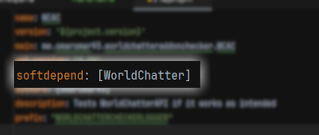

# WorldChatter Addon Template!
## Here you can learn how to implement it in your plugin!

# Step 1
## Add the plugin via maven by adding the jar from jitpack.io
```xml
     <repositories>
		<repository>
		    <id>jitpack.io</id>
		    <url>https://jitpack.io</url>
		</repository>
	</repositories>

    <dependencies>
            <dependency>
                <groupId>com.github.OmarOmar93</groupId>
                <artifactId>WorldChatter</artifactId>
                <version>2.4.10</version>
            </dependency>
    </dependencies>
```
### and make sure that you depend it in ## You need to add the plugin as an external library in your projectur **"plugin.yml"**


"softdepend" or "depend" as you like ^^

# Step 2
## add this code to make it able to work and register the listener into any class you like!
```java
 @Override
public void onEnable() {
    APICore api = new APICore();
    api.addListener(new Plugin(this.getName(),this.getDescription().getDescription(),this.getDescription().getAuthors()), new Listener());
}
```
# Step 3
## in your new listener class add "implements WorldChatterAPI" on the class and add all the methods
```java
public class Listener implements WorldChatterAPI {
    @Override
    public void messageDetect(ChatEvent chatEvent, List<String> list, Object o) {
        System.out.println("Event Check: " + chatEvent.getMessage() + " flags: " + String.join(", ", list));
    }

    @Override
    public void chatLockToggle(CommandSender commandSender, boolean b, Object o) {
        System.out.println("ChatLock Toggled to " + b);
    }


    @Override
    public void updateChecked(boolean b) {
        System.out.println("Is it updated?: " + (b ? "yes" : "no"));
    }

    @Override
    public void configReload(CommandSender commandSender, Object o) {
        if (commandSender == null) {
            System.out.println("Config has been executed by WorldChatter");
        } else {
            System.out.println("Config has been executed by " + commandSender.getName());
        }
    }
}
```

## and now you are ready to create an Addon!