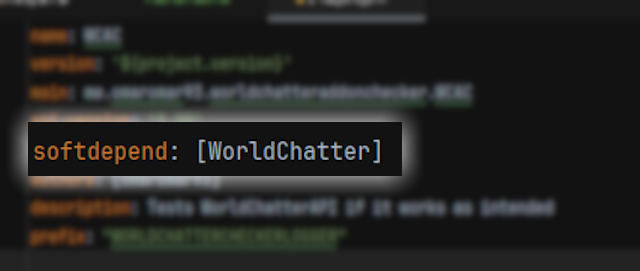

# WorldChatter Addon Template!
## Here you can learn how to implement it in your plugin!

# Step 1
## Add the plugin's jar into ur project's library

## That's if you want to support WorldChatter in ur plugin the rest of the steps are for WorldChatter Addons.

### and make sure that you depend it in ## You need to add the plugin as an external library in your projectur **"plugin.yml"**


"softdepend" or "depend" as you like ^^

# Step 2
## add this code to make it able to work and register the listener into any class you like!
```java
@Override
public void onEnable() {
    // new
    final WCA api = new WCA();
    final Addon main = api.createWCAddon(this.getName(),this.getDescription().getAuthors().get(0),this.getDescription().getDescription(),"WCAC","1.0");
    api.addListener(main, new Listener());
}
```
# Step 3
## in your new listener class add "implements WorldChatterAPI" on the class and add all the methods
```java
public class Listener implements WCListener {

    @Override
    public void messageDetect(List<String> list, Player player, String s) {
        System.out.println("Event Check: " + s + " flags: " + String.join(", ", list));
    }

    @Override
    public void chatLockToggle(CommandSender commandSender) {
        System.out.println("ChatLock Toggled to " + ChatLock.INSTANCE.isLocked());
    }

    @Override
    public void updateChecked(CommandSender commandSender) {
        System.out.println("Is it updated?: " + (UpdateSystem.INSTANCE.getBuild() > 200 ? "yes" : "no"));
        System.out.println("Is development build?: " + (UpdateSystem.INSTANCE.isDev() ? "yes" : "no"));
    }

    @Override
    public void senderConfigReload(CommandSender commandSender) {
        if (commandSender == null) {
            System.out.println("Config has been executed by WorldChatter");
        } else {
            System.out.println("Config has been executed by " + commandSender.getName());
        }
    }

    @Override
    public void onMessage(FeatureSystem featureSystem, CommandSender commandSender, String s) {
        featureSystem.setCancelled(true); // disabled the event
        featureSystem.setCancelled(false); // didn't disable the event :P
        featureSystem.setReason("The reason is that for testing purposes only");
    }
    
    
}
```

## and now you are ready to create an Addon!
